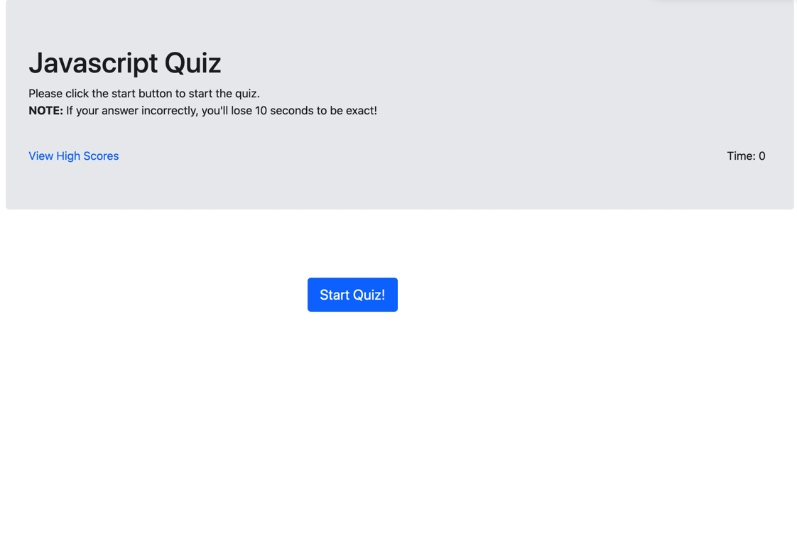
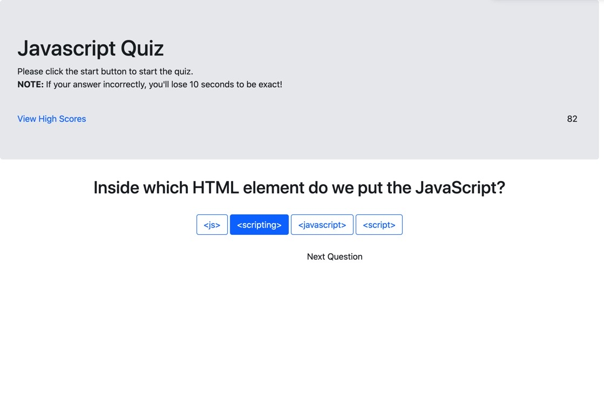

# Code-Quiz

GWU Full Stack Project: 

JavaScript: Code Quiz

This application generates a random password based on user-selected criteria. It will also feature a clean and polished user interface and be responsive.

Table of contents:

1. Quick start
2. User Story
3. Acceptance Criteria
5. Project description
4. Creators


## Quick start
1. Clone the repo: https://gw.bootcampcontent.com/GW-Coding-Boot-Camp/gwu-arl-fsf-pt-08-2020-u-c.git
2. Pull the latest code version


## User Story
```
AS A coding bootcamp student
I WANT to take a timed quiz on JavaScript fundamentals that stores high scores
SO THAT I can gauge my progress compared to my peers

```


## Acceptance Criteria
```
GIVEN I am taking a code quiz
WHEN I click the start button
THEN a timer starts and I am presented with a question
WHEN I answer a question
THEN I am presented with another question
WHEN I answer a question incorrectly
THEN time is subtracted from the clock
WHEN all questions are answered or the timer reaches 0
THEN the game is over
WHEN the game is over
THEN I can save my initials and score

```

## Project description



The code quiz request user a series of questions about JavaScript and countdown timer to answer the questions. The user is given 90 seconds to start the quiz and each wrong answer results will reduce the time. The user's final scroe is equal to the number of seconds left on the clock after the final question is answered. To start the quiz, clicks the "Start" button on the home page.



Once the quiz is started, the user is presented with a questions and multpile answers. 


Once the final question is completed, will take the user to the score page and fisplay the final score of the quiz. User also can click on the "Return To Home" button to retake the quiz.

## Creators

Project created by: Venus Hu 

Github: 
https://github.com/Venus1001/Code-Quiz.git